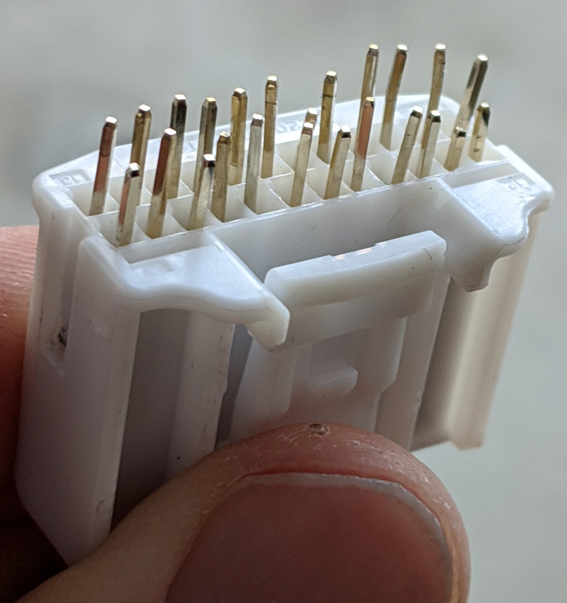

# G37 Screen Slaver

## Purpose

The Screen Slaver plugs directly into the internal display of an Infiniti G37 (non-navigation). 
The Screen Slaver accepts the factory harness as an input, as well as external RGBS and EN signals.

When EN is HIGH, the Screen Slaver injects the external RGBS signal to the factory display. 
When EN is LOW (default), the RGBS signal from the factory harness is passed through.

Combined with the [Boomerang](https://github.com/icecube45/Boomerang), the Screen Slaver allows for easy car computer integration into an Infiniti G37.

## Gotchas

* On the stock display of a G37, the backup camera is provided on a separate composite input. The AV unit then uses an AREA signal to tell the display to use the RGBS input as an overlay, and overlays alignment lines and proximity warnings. This can result in an unexpected display when in reverse and EN is HIGH.

* There is no male through-hole version of the connector series for the factory harness. J2 is thus composed of a male crimp version of the connector, crimped to small lengths of solid core wire, in order to mimic a through-hole component. It's a huge pain to build, but the results are worth it. The one I made can be seen below.

  

#### Changelog:

* 6/9/2020: Initial Release

